# SwiftUI challenges

## Welcome 🤙🏻✌🏻🖖🏻

This project contains helpful and useful examples of animations developed with SwiftUI.

You may find some inspiration 💡 for your current or next project or you may take challenge to make it yourself 💪🏻

Demo videos and gifs you may find in every event.

👨🏻‍💻 Feel free to subscribe to channel **[SwiftUI dev](https://t.me/swiftui_dev)** in telegram.

## Communication

- If you **have a feature request or the any ideas**, open an issue or submit a implementation via a pull request or hit me up on **lexkraev@gmail.com** or **[telegram](https://t.me/lexkraev)**.
- If you **want to contribute**, submit a pull request onto the master branch.

## 1. [Lamp 💡](https://github.com/c-villain/SwiftUI-challenges/blob/main/SUIChallenges/SUIChallenges/1.Lamp.swift)
  
  [Lamp challenge full video demo](https://t.me/swiftui_dev/184)
  
  

  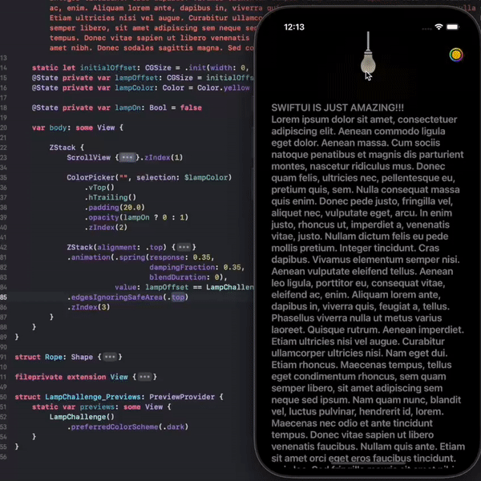
  

 
## 2. [Spotify 📊](https://github.com/c-villain/SwiftUI-challenges/blob/main/SUIChallenges/SUIChallenges/2.Spotify.swift)
 
  [Spotify challenge full video demo](https://t.me/swiftui_dev/185)
 
  

  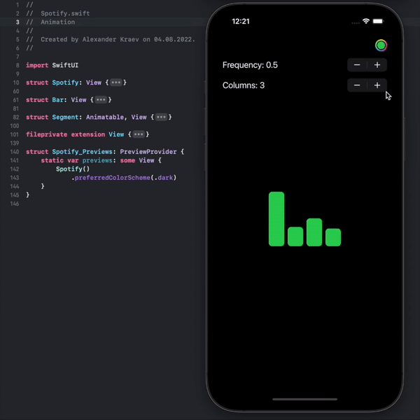
  

 
## 3. [AirDrop 📱](https://github.com/c-villain/SwiftUI-challenges/blob/main/SUIChallenges/SUIChallenges/3.AirDrop.swift)
 
  [Airdrop challenge full video demo](https://t.me/swiftui_dev/186)
 
  

  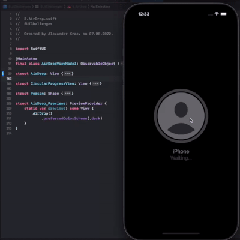
  

 
## 4. [Fireworks 🎉](https://github.com/c-villain/SwiftUI-challenges/blob/main/SUIChallenges/SUIChallenges/4.Firework.swift)
 
  [Fireworks full video demo](https://t.me/swiftui_dev/187)
 
  

  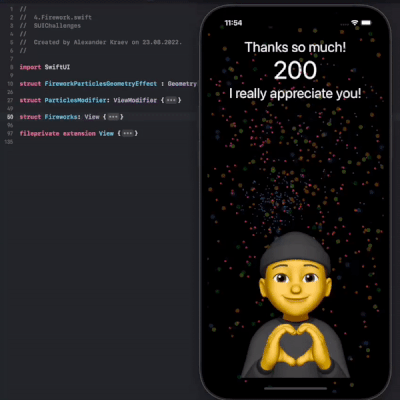
  

  
## 5. [Flex cards 🌆🌅🌄](https://github.com/c-villain/SwiftUI-challenges/blob/main/SUIChallenges/SUIChallenges/5.FlexCards.swift)
 
  [Flex cards full video demo](https://t.me/swiftui_dev/191)
 
  

  
  

  
## 6. [Hamburgers 🍔](https://github.com/c-villain/SwiftUI-challenges/blob/main/SUIChallenges/SUIChallenges/6.Hamburgers.swift)
 
  [Hamburgers full video demo](https://t.me/swiftui_dev/193)
 
  

  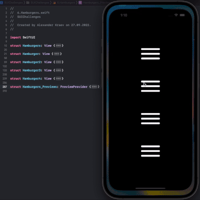
  

  
## 7. [Waved tab bar 🌊](https://github.com/c-villain/SwiftUI-challenges/blob/main/SUIChallenges/SUIChallenges/7.WavedTabView.swift)
 
  [Waved tab bar full video demo](https://t.me/swiftui_dev/194)
  
  [Separate demo project](https://github.com/c-villain/WavedTabView)
  
  

  

  
  
  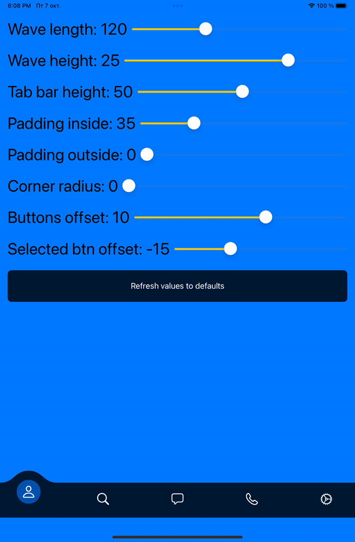
  

  
## 8. [Sneakers shop concept 👟](https://github.com/c-villain/SwiftUI-challenges/blob/main/SUIChallenges/SUIChallenges/8.SneakersShop.swift)
 
 [Sneakers shop concept full video demo](https://t.me/swiftui_dev/195)
 
  

  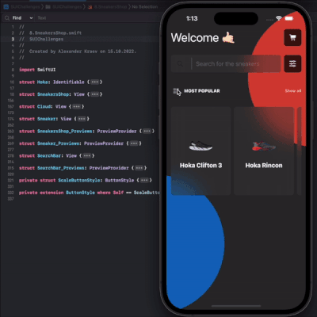
  

  
## 9. [Dynamic Island 🏝](https://github.com/c-villain/SwiftUI-challenges/blob/main/SUIChallenges/SUIChallenges/9.DynamicIsland.swift)
 
 [Dynamic Island full video demo](https://t.me/swiftui_dev/196)
 
  

  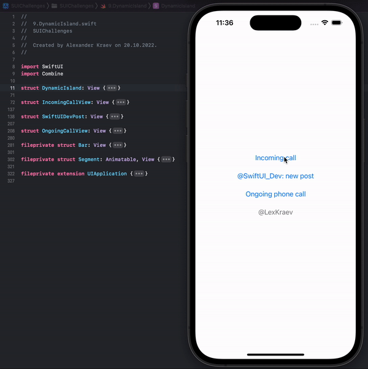
  

  
## 10. [Fast food cafe animation 🍟](https://github.com/c-villain/SwiftUI-challenges/blob/main/SUIChallenges/SUIChallenges/10.FastFoodLogo.swift)

  [Fast food cafe animation full video demo](https://t.me/swiftui_dev/198)

  

  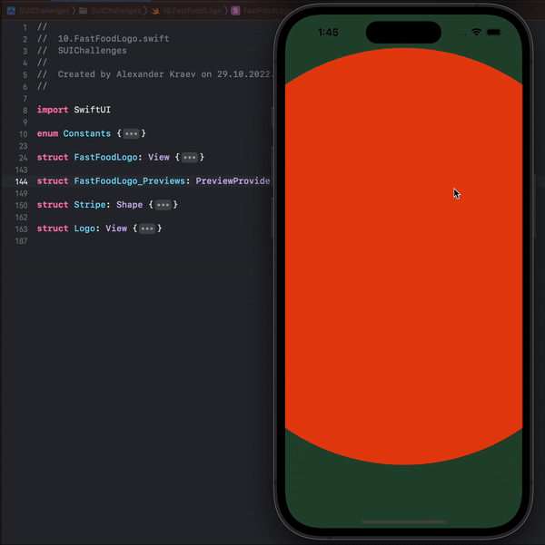
  

## 10. [Panerai watches ⌚️](https://boosty.to/lexkraev/posts/becd1a9a-7402-45e3-821c-8fb0ae51d42f)

  [Panerai watches full video demo](https://t.me/swiftui_dev/200)

  

  
  

## 10. [Loader 📶](https://boosty.to/lexkraev/posts/7ed82e08-0c72-4e77-99e1-61b05ef3449b)

  [Loader full video demo](https://t.me/swiftui_dev/211)

  

  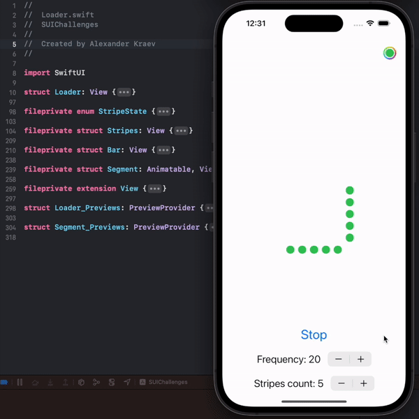
  

  
## 11. [Vertical watches 📶⌚️](https://boosty.to/lexkraev/posts/a2b9780a-d039-4feb-960f-0d94ff4096d8)

  [Full video demo](https://t.me/swiftui_dev/212)

  

  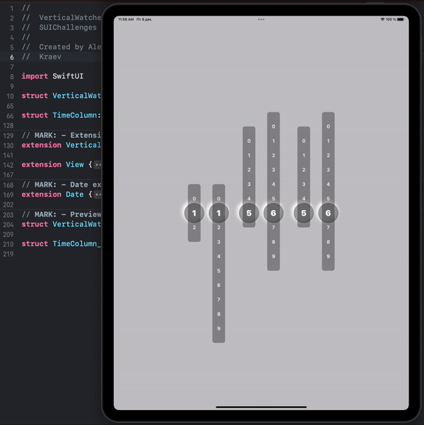
  

  
 ## 12. [Kavsoft challenge 🦸🏼‍♂️](https://boosty.to/lexkraev/posts/f40ac449-f7d9-4c77-804e-5c22a9b3a9b1)

  [Full video demo](https://t.me/swiftui_dev/217)

  

  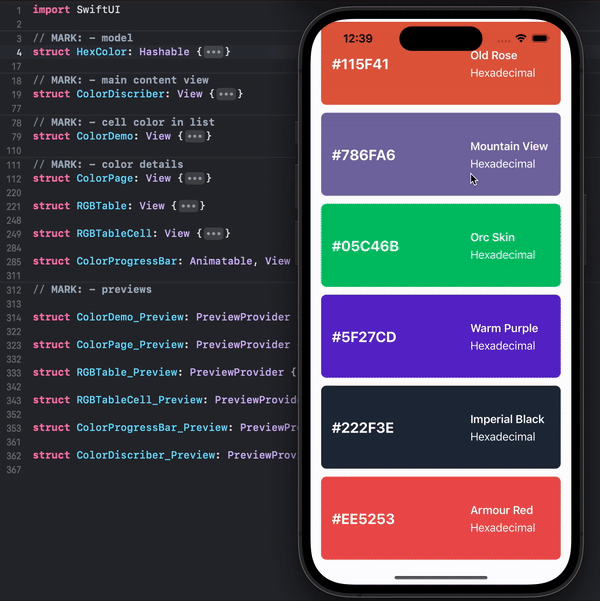
  

