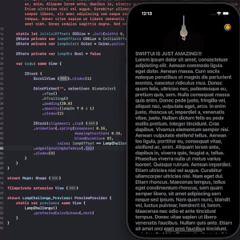

# SwiftUI challenges

 1. [Lamp](https://github.com/c-villain/SwiftUI-challenges/blob/main/SUIChallenges/SUIChallenges/1.Lamp.swift)
 

 
 

 

 
 

 
 2. [Spotify](https://github.com/c-villain/SwiftUI-challenges/blob/main/SUIChallenges/SUIChallenges/2.Spotify.swift)
 3. [AirDrop](https://github.com/c-villain/SwiftUI-challenges/blob/main/SUIChallenges/SUIChallenges/3.AirDrop.swift)
 4. [Fireworks](https://github.com/c-villain/SwiftUI-challenges/blob/main/SUIChallenges/SUIChallenges/4.Firework.swift)
 5. [Flex cards](https://github.com/c-villain/SwiftUI-challenges/blob/main/SUIChallenges/SUIChallenges/5.FlexCards.swift)
 6. [Hamburgers](https://github.com/c-villain/SwiftUI-challenges/blob/main/SUIChallenges/SUIChallenges/6.Hamburgers.swift)
 7. [Waved tab bar](https://github.com/c-villain/SwiftUI-challenges/blob/main/SUIChallenges/SUIChallenges/7.WavedTabView.swift)
 8. [Sneakers shop concept](https://github.com/c-villain/SwiftUI-challenges/blob/main/SUIChallenges/SUIChallenges/8.SneakersShop.swift)
